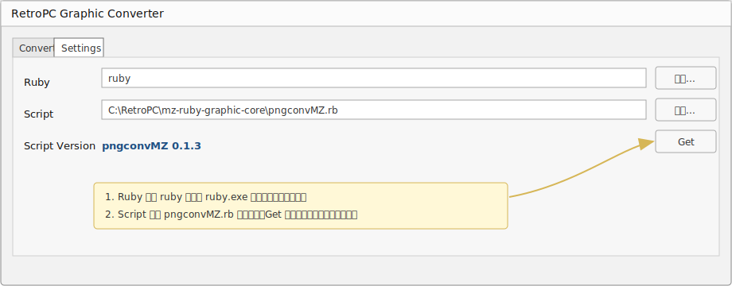

# RetroPC Graphic Converter GUI

レトロPC向け画像変換スクリプトをWindows GUIから実行し、元画像・変換後PNG・生成ファイルを確認するためのVisual Studioソリューションです。

## Repository Layout

```text
MzGraphicConv/
  MzGraphConvApp/
    MzGraphConvApp.sln
    MzRubyConvGui/       # 現在のRuby変換GUI
```

現在の開発対象は `MzGraphConvApp/MzRubyConvGui` です。旧サンプルプロジェクト `MzGraphConvApp/MzGraphConvApp` は削除済みです。

## Requirements

- Windows
- Visual Studio 2022
- .NET SDK 8.0
- Ruby
- 画像変換Rubyスクリプト
  - 例: `D:\home\work\ruby\imagetrans\pngconvMZ.rb`

Rubyスクリプト本体はこのGUIプロジェクトの外部に置き、GUIの `Settings` タブにある `Script` 欄で指定する運用を想定しています。

## Initial Setup

初回起動後、まず `Settings` タブでRuby実行ファイルと変換スクリプトを指定してください。



### 1. Ruby

`Ruby` にはRuby実行ファイルを指定します。

RubyにPATHが通っている場合は、既定値のまま `ruby` で動作します。動作しない場合は `参照...` から `ruby.exe` を指定してください。

例:

```text
ruby
```

または:

```text
C:\Ruby32-x64\bin\ruby.exe
```

### 2. Script

`Script` にはRuby変換スクリプト `pngconvMZ.rb` を指定します。

例:

```text
D:\home\work\ruby\imagetrans\pngconvMZ.rb
```

このGUIにはRubyスクリプト本体を同梱しません。別途 `pngconvMZ.rb` を取得し、Ruby側READMEに従って必要なgemをインストールしてください。

### 3. Script Version

`Get` ボタンを押すと、指定したスクリプトに対して以下を実行し、バージョン情報を表示します。

```powershell
ruby pngconvMZ.rb --json --info
```

正常に取得できる場合は、以下のように表示されます。

```text
pngconvMZ 0.1.0-alpha
```

ここまで確認できれば、`Convert` タブで入力画像、出力先、変換条件を指定して実行できます。

## Build

ソリューションをVisual Studioで開く場合:

```text
MzGraphConvApp/MzGraphConvApp.sln
```

コマンドラインでビルドする場合:

```powershell
dotnet build .\MzGraphConvApp\MzRubyConvGui\MzRubyConvGui.csproj
```

## Release Package

配布用ZIPを作成する場合:

```powershell
.\scripts\package-release.ps1
```

PowerShellの実行ポリシーで止まる場合:

```powershell
powershell -NoProfile -ExecutionPolicy Bypass -File .\scripts\package-release.ps1
```

既定では以下を作成します。

```text
dist/MzRubyConvGui-win-x64.zip
```

この配布ZIPにはGUI本体のみを含めます。Ruby本体と `pngconvMZ.rb` は同梱しません。ユーザーはRubyを別途インストールし、GUIの `Ruby` 欄と `Script` 欄で使用するRuby実行ファイルと変換スクリプトを指定してください。

自己完結型として.NETランタイム込みでpublishしたい場合:

```powershell
.\scripts\package-release.ps1 -SelfContained $true
```

通常はZIPサイズを抑えるため、.NET Desktop Runtimeを別途インストールしてもらう前提の既定設定を使います。

## MzRubyConvGui

主な機能:

- Rubyスクリプトのコマンドライン引数をGUIから指定
- `Settings` タブでRuby実行ファイルと変換スクリプトを指定
- `Settings` タブで変換スクリプトのバージョン情報を確認
- 入力画像 PNG/JPEG、出力フォルダ、ベース名の指定と履歴保存
- PNGのみ出力の指定
- 変換後PNG/BRD/BSD/Paletteファイルの一覧表示
- 元画像とPreview画像の比較表示
- 拡大ウィンドウでの同期ズーム/同期パン
- split320x200出力のUpper/Lower比較表示
- Preview表示のアスペクト補正切替
- 実行中キャンセル
- 上書き確認

ユーザー設定は以下に保存されます。

```text
%LOCALAPPDATA%\MzRubyConvGui\settings.json
```

この設定ファイルは個人環境依存のためGit管理対象外です。

## Git Policy

Gitにはソースコード、ソリューション、プロジェクトファイル、READMEなどを含めます。

Gitに含めないもの:

- Visual Studioの作業状態
- `bin/`, `obj/`
- `.csproj.user`
- ローカル設定ファイル
- 変換結果のPNG/BRD/BSD/Paletteなど

初回にGit管理を開始する場合:

```powershell
git init
git status
git add README.md .gitignore MzGraphConvApp
git commit -m "Initial GUI project"
```

既にGitリポジトリがある場合は、通常通り `git status` で差分を確認してから追加してください。
